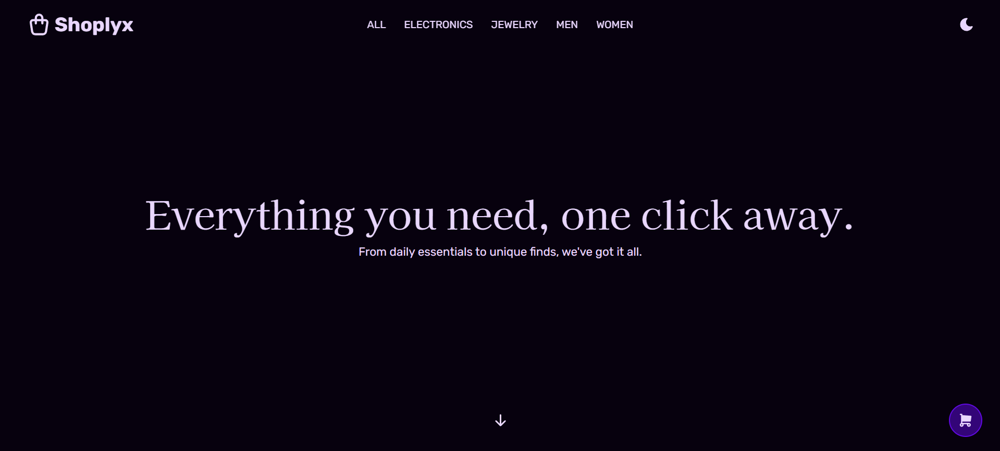

# 🛍️ Shoplyx

Proyecto frontend de un e-commerce con carrito de compras.



## ✨ Features
- 🔽 Filtro de productos por tipo
- 🛒 Carrito de compras

## 🛠️ Tecnologías
- React
- JavaScript
- Tailwind CSS
- Fake Store API

## 🚀 Instalación
> Este proyecto utiliza Pnpm como runtime y gestor de paquetes.

```
git clone git@github.com:Over12/app-shop.git
cd app-shop
pnpm install
pnpm dev
```

## 🧑‍💻 Autor
- **Pedro Avalos Figueroa**
- Desarrollador Web
- GitHub: https://github.com/Over12